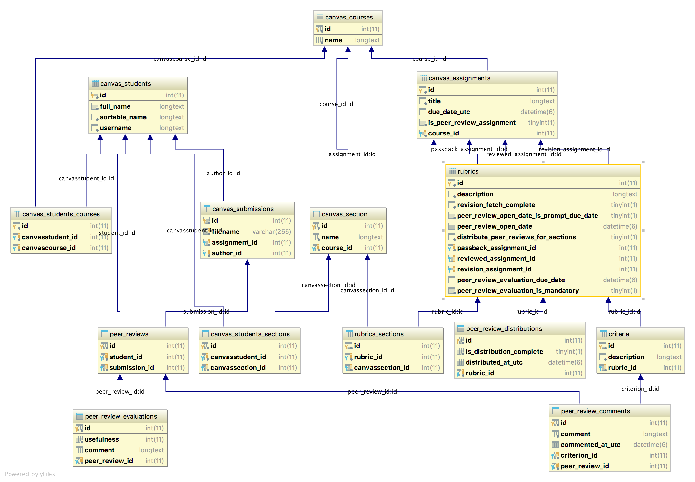

# Data Model

M-Write Peer Review's data model can be broadly separated into two categories:
1. Canvas resources that we import and track
2. Application-specific models for storing data we generate or capture entirely on the M.P.R. side

Canvas models use their Canvas resource IDs as their primary key, whereas application-specific models use an
auto-incremented primary key.

All models are kept in [`peer_review.models`](/peer_review/models.py).  Some models have simple property
implementations, but more complex query / update logic is generally placed in
[`peer_review.queries`](/peer_review/queries.py).

Migrations and rollbacks are handled using the
[Django migrate command](https://docs.djangoproject.com/en/1.11/topics/migrations/).

## UML 

(Django-specific models have been omitted for clarity.)

## Canvas Resources

See the [Canvas API documentation](https://canvas.instructure.com/doc/api/index.html) for reference.

### Models

Most of these only track the bare minimum of fields that M.P.R. requires.

* `CanvasCourse` (`canvas_courses` table)
* `CanvasStudent` (`canvas_students` table)
* `CanvasSection` (`canvas_sections` table)
* `CanvasAssignment` (`canvas_assignments` table)
* `CanvasSubmission` (`canvas_submissions` table)

### Many-To-Many / Join Tables

* `CanvasStudent` <-> `CanvasCourse` (`canvas_students_courses` table)
* `CanvasStudent` <-> `CanvasSection` (`canvas_students_sections` table)

## Application-Specific Models

### Models

Models have bullet points to explain columns that bear special remarks; self-explanatory columns have been omitted.

* `Rubric` (`rubrics` table)
    * Tracks the rubric and its constituents
    * `reviewed_assignment_id` is a foreign key to `canvas_assignments` that represents the writing prompt assignment
    * `passback_assignment_id` is a foreign key to `canvas_assignments` that represents the peer review assignment / LTI
    assignment 
    * `revision_assignment_id` is a foreign key to `canvas_assignments` that represents the prompt revision assignment
    * `peer_review_open_date` can be either the due date of `reviewed_assignment_id`, or an instructor-specified date;
    [`peer_review.etl` module](/peer_review/etl.py) has logic to keep these in sync
    * `revision_fetch_complete` is currently unused (and should always be `False`); see
    [#237](https://github.com/M-Write/mwrite-peer-review/issues/237)
    * `distribute_peer_reviews_for_sections` is currently unused / disabled / vestigial due to lack of user demand and
    should always be `False`
* `PeerReviewDistribution`
    * Keeps track of whether peer reviews for a given rubric have been distributed (and when)
    * This is really a property of an individual rubric, and should be merged into `rubric`
    (see [#348](https://github.com/M-Write/mwrite-peer-review/issues/348))
* `Criterion`
    * A single rubric criterion
* `PeerReview`
    * A tuple that signifies that a given `student_id` is assigned to review a particular `submission_id`; these should
    be unique together (i.e, there should be exactly one row with a given combination of these two fields)
* `PeerReviewComment`
    * A reviewer comment for a particular `PeerReview` and `Criterion`
* `PeerReviewEvaluation`
    * A "review of a (specific) peer review"

### Many-To-Many / Join Tables

* `Rubric` <-> `CanvasSections` (`rubrics_sections` table)
    * This join table is currently vestigial / unused due to lack of user demand.
